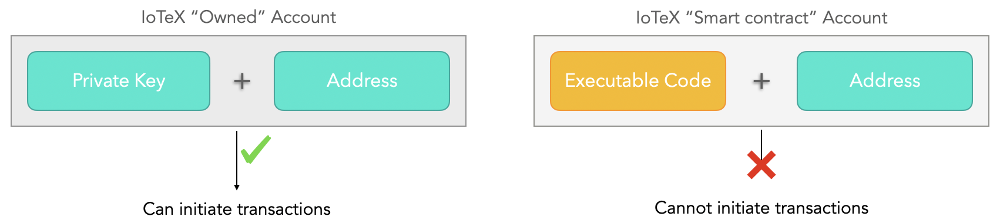

# Accounts

An Account represents any entity participanting in the IoTeX network, that can be a user, a device, an enterprise, or even a piece of software that lives on the blockchain itself \(a so called _smart contract_\). Each IoTeX account always has a "public key" and a "Private key" associated with it. The public key can be represented as a human-readable string of 41 characters by `io1...`, that is referred to as the **Address** of the account.

A typical address in the IoTeX blockchain looks like this:

`io1juvx5g063eu4ts832nukp4vgcwk2gnc5cu9ayd`

Similarly to other smart contract platforms, in IoTeX we have two type of accounts: **owned** accounts that have a known **private key** associated with them \(typically owned by people, enterprises or IoT devices that initiate actions from those accounts\), and **smart contract** accounts that do not have a known private key associated with them, hence they cannot initiate actions.

