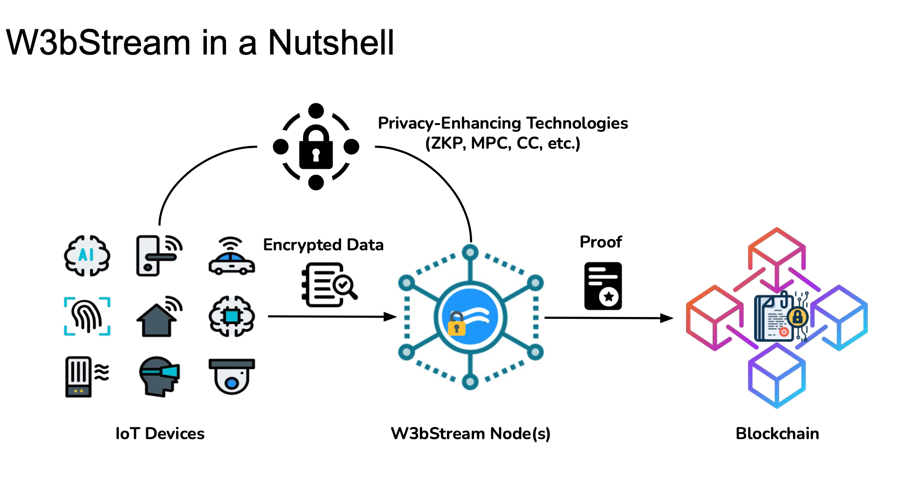

# ioTube Bridge

<figure><figcaption></figcaption></figure>

[ioTube](https://iotube.org) is a cross-chain bridge designed to be **decentralized**, **multi-chain**, and **multi-asset**.

[ioTube ](https://iotube.org/)enables **bi-directional** exchange of tokens between [IoTeX](https://iotex), [Ethereum](https://ethereum.org), [Binance Smart Chain](https://www.binance.org/en/smartChain), and now [Polygon](https://polygon.technology/)!&#x20;


Checkout the full documentation in the [ioTube Docs](http://127.0.0.1:5000/o/-MQ9LhchTp7\_QJr-AYG0/s/-MgvoWpXLOm6Tf5h6ulz/) or \
head over to [ioTube](https://iotube.org) to make your dApp cross-chain.&#x20;

