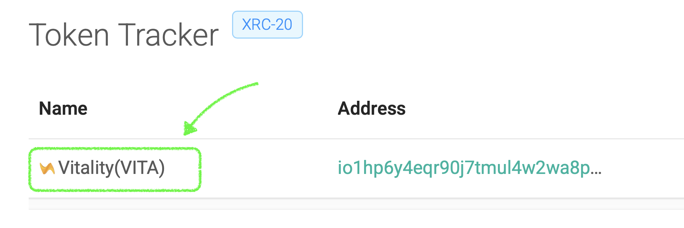

# Submit Token Metadata

IoTeX Provides a [Token Metadata Repository](https://github.com/iotexproject/iotex-token-metadata#iotex-token-metadata) where anyone who deployed a token on IoTeX can submit metadata for it to be better integrated with the official block explorer at [https://iotexscan.io/tokens](https://iotexscan.io/tokens), with [IoPay Wallets ](https://iopay.iotex.io/)and other IoTeX apps.

Because any app developer can make use of this metadata repository to display IoTeX tokens data, it's always a good idea to submit the metadata for your tokens!

Check out the [Token Metadata Repository ](https://github.com/iotexproject/iotex-token-metadata#iotex-token-metadata)for detailed instructions on how to submit your data.

