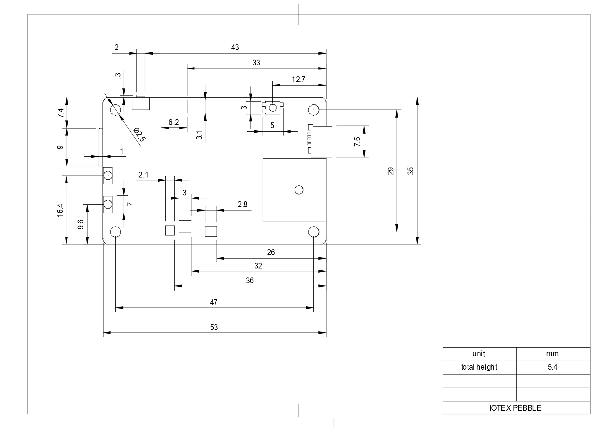

# Technical Specification

Pebble is a battery-powered, cellular-based, multi-sensor **development board** designed by IoTeX and [Nordic Semiconductor](https://www.nordicsemi.com/), combining tamper-proof hardware and tamper-proof software to generate verifiable data.

Pebble is equipped with high-quality **GPS**, **climate**, **motion**, and **light** sensors. Data can be easily streamed in real-time to an MQTT endpoint for use in Cloud or blockchain-based applications.

Pebble utilizes a **secure element** (nRF9160) to cryptographically sign all data, providing unparalleled verifiability and traceability for asset tracking, supply chain, and other applications.

.png>)

### CPU <a href="#processor" id="processor"></a>

Pebble is powered by a 64 MHz Arm® Cortex®-M33, 1 MB Flash and 256 KB RAM, with automated power and clock management, Arm TrustZone, and Arm CryptoCell 310

### Integrated Sensors <a href="#integrated-sensors" id="integrated-sensors"></a>

Pebble combines an **environmental sensor** (temperature, relative humidity, barometric pressure, altitude, and volatile organic compounds - VOCs), a **motion sensor** (3-axis gyroscope, 3-axis accelerometer), and an ambient **light sensor**. It's also equipped with cellular network connectivity and integrated GPS supporting precise, long range tracking of asset data using established cellular infrastructure.

| Sensor                                                                                                                              | Details                                                                                                                                   |
| ----------------------------------------------------------------------------------------------------------------------------------- | ----------------------------------------------------------------------------------------------------------------------------------------- |
| [Environmental Sensor BME680](https://www.bosch-sensortec.com/products/environmental-sensors/gas-sensors-bme680/)                   | <p>Relative humidity</p><p>Barometric pressure</p><p>Ambient temperature</p><p>Air quality (VOC)</p>                                      |
| [Motion Sensor ICM-42605](https://www.invensense.com/products/motion-tracking/6-axis/icm-42605/)                                    | <p>3-axis gyroscope</p><p>3-axis accelerometer</p>                                                                                        |
| [External GPS TD1030](http://www.techtotop.com/detail.aspx?cid=956)                                                                 | <p>Position accuracy: 3m</p><p>Speed accuracy: 0.1 m/s</p><p>Data frequency: 1 hz to 10 Hz</p>                                            |
| [Ambient Light Sensor AMS TSL2572](https://ams.com/tsl25721)                                                                        | <p>45,000,000:1 Dynamic Range</p><p>Operation to 60,000 lux in Sunlight</p><p>Very High Sensitivity</p><p>Package UV Rejection Filter</p> |
| [Buzzer Mallory Sonalert AST7525MATRQ](https://www.mallory-sonalert.com/DetailPage.aspx?Catalog\_Number=AST7525MATRQ\&Part\_Id=452) | <p>Frequency: 2700 Hz</p><p>Sound Pressure Level (dB/min): 85 at 10cm</p>                                                                 |

### Network Connectivity <a href="#network-connectivity" id="network-connectivity"></a>

Pebble includes a Multimode LTE-M/NB-IoT modem for cellular communication. To have your Pebble connected to the Internet you will need an _I_oT-enabled\*\* SIM card that supports either NB-IoT or LTE standards.

### Data format <a href="#data-format" id="data-format"></a>

JavaScript Object Notation (JSON) is utilized to represent the sensor data collected by a Pebble as well as the corresponding ECDSA digital signature. Pebble utilizes ECDSA over the elliptic curve `sepc256r1` to sign the collected sensor data (i.e., the _message_ field in the Pebble data format)

Supported data types include _Number_, _String_ and _Array_ defined as follows:

| Data Type | Data Size              | Data Range               |
| --------- | ---------------------- | ------------------------ |
| Array     | 16-bit                 | -32768 \~ +32768         |
| Number    | 64-bit                 | -1.79E+308 \~ +1.79E+308 |
| String    | null-terminated string |                          |

An example of a JSON object containing a data point collected by the Pebble is shown below, it consists of a sensor data object named _"message"_, and a digital signature data object named _"signature"_:

```javascript
{
	message: {
		SNR: 2,
		VBAT: 4.0750732421875,
		latitude: 3050.69225,
		longitude: 11448.65815,
		gas_resistance: 1166811,
		temperature: 36.23188400268555,
		pressure: 1003.82000732421885,
		humidity: 55.755001068115234,
	  light: 1639.67767,
		gyroscope: [-12, 11, 14],
		accelerometer: [-711, -231, 8260],
		timestamp: 3443547577,
    random: "3767398368",
    rsa_n: "0xa709e2f84ac0e21eb0caa018cf7f697...8f628698f0c7b420c4b7",
    rsa_e: "0x010001"
	},

	signature:  {
		r: "D7797968EAA3FFE5F8057C9D97F707A4A96CBFC250115FE6293EBA5E90327174",
		s: "643A8CB823110376A5D30201463CF69CDF8CBF1C050EB85B023CABFB589C3222"
	}
}
```

The _message_ object includes the following sensor data:

| Sensor Data      | Data Type | Description                                                                                                         |
| ---------------- | --------- | ------------------------------------------------------------------------------------------------------------------- |
| `SNR`            | Number    | Signal-to-noise ratio of NB-IoT/LET-M                                                                               |
| `VBAT`           | Number    | Voltage of battery                                                                                                  |
| `latitude`       | Number    | gps latitude                                                                                                        |
| `longitude`      | Number    | gps longitude                                                                                                       |
| `gas_resistance` | Number    | Air quality (indoor)                                                                                                |
| `temperature`    | Number    | Environmental temperature                                                                                           |
| `pressure`       | Number    | Air pressure                                                                                                        |
| `humidity`       | Number    | Environmental humidity                                                                                              |
| `light`          | Number    | Ambient Light                                                                                                       |
| `gyroscope`      | Array     | Angular velocity around the X-axis, Y-axis and Z-axis                                                               |
| `accelerometer`  | Array     | Acceleration along the X-axis, Y-axis and Z-axis                                                                    |
| `timestamp`      | String    | Timestamp of sensor data sampling                                                                                   |
| `random`         | Number    | A random number generated by the onboard random number generator                                                    |
| `rsa_n`          | Number    | Modulus of the RSA keys  (only provided in specific applications where on-chain data encryption is involved)        |
| `rsa_e`          | Number    | Public exponent of the RSA keys (only provided in specific applications where on-chain data encryption is involved) |

The _signature_ data object contains the following signature data:

| Digital Signature | Data Type | Description                   |
| ----------------- | --------- | ----------------------------- |
| `r`               | Number    | r value of an ECDSA signature |
| `s`               | Number    | s value of an ECDSA signature |

### Onboard RGB Led <a href="#onboard-rgb-led" id="onboard-rgb-led"></a>

Pebble includes an RGB led to show the status of the Pebble, the table below shows all the possible led states and the respective meaning:

| LED Color (Blink Rate)                 | GPS Signal | Charging | NB-IoT/LTE Connection | Flashing the Firmware |
| -------------------------------------- | ---------- | -------- | --------------------- | --------------------- |
| Blue (fast)                            |            |          |                       |                       |
| Blue (slow)                            |            |          | ✓                     |                       |
| <p>Red (steady) +<br>Purple (fast)</p> |            | ✓        |                       |                       |
| <p>Red (steady) +<br>Purple (slow)</p> |            | ✓        | ✓                     |                       |
| Cyan (fast)                            | ✓          |          |                       |                       |
| Cyan (slow)                            | ✓          |          | ✓                     |                       |
| <p>Red (steady) +<br>White (fast)</p>  | ✓          | ✓        |                       |                       |
| <p>Red (steady) +<br>White (slow)</p>  | ✓          | ✓        | ✓                     |                       |
| Red (fast)                             |            |          |                       | ✓                     |

Note that the led will blink at least twice in 1 second when in _fast_ mode, and once in 5 seconds when in _slow_ mode.

### 2D Drawing <a href="#_2d-drawing" id="_2d-drawing"></a>




2D Drawing | PDF



2D Drawing | DXF


