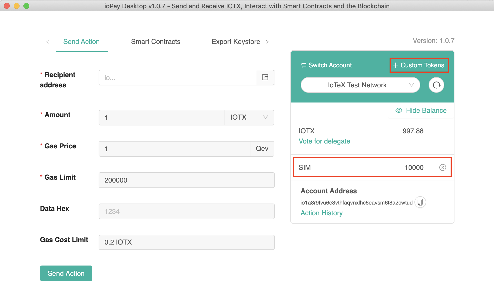

# Issue XRC20 Tokens on IoTeX

IoTeX fully supports ERC20 and ERC721 Ethereum token standards, so that you can port any existing Ethereum token to IoTeX with no changes at all to the code. In IoTeX, XRC20 is the name of the token standard equivalent to the ERC20 on Ethereum, while XRC721 is the equivalent for ERC721.

As a quick example, let's see how to deploy an XRC20 token on IoTeX in a few simple steps:

### 1. Open ioPay Desktop

In this example, we will use the ioPay Desktop wallet to deploy the contract. Download ioPay Desktop wallet from [http://iopay.iotex.io/desktop](http://iopay.iotex.io/desktop/), create a new account or import a private key if you have one, and select the _Test Network_ from the Network Combobox.


Finally, get some IOTX test tokens from any [IoTeX faucet](../iotx-faucets.md) and send them to your IoPay account address.

### 2. Edit Solidity code in IoTeX Studio IDE

IoTeX Studio is the Web IDE to develop and deploy IoTeX Smart Contracts. In IoTeX Studio you can compile, deploy and interact with your smart contracts. Let's use the following example contract from OpenZeppelin to deploy a [Simple Token ](https://github.com/OpenZeppelin/openzeppelin-contracts/blob/release-v2.5.0/contracts/examples/SimpleToken.sol)contract.

Open IoTeX Studio at [ide.iotex.io](https://ide.iotex.io/), delete any existing code in the editor, and paste the following code:

```cpp
pragma solidity ^0.5.0;

import "https://github.com/OpenZeppelin/openzeppelin-contracts/blob/release-v2.5.0/contracts/GSN/Context.sol";
import "https://github.com/OpenZeppelin/openzeppelin-contracts/blob/release-v2.5.0/contracts/token/ERC20/ERC20.sol";
import "https://github.com/OpenZeppelin/openzeppelin-contracts/blob/release-v2.5.0/contracts/token/ERC20/ERC20Detailed.sol";

/**
 * @title SimpleToken
 * @dev Very simple ERC20 Token example, where all tokens are pre-assigned to the creator.
 * Note they can later distribute these tokens as they wish using `transfer` and other
 * `ERC20` functions.
 */
contract SimpleToken is Context, ERC20, ERC20Detailed {

    /**
     * @dev Constructor that gives _msgSender() all of existing tokens.
     */
    constructor () public ERC20Detailed("SimpleToken", "SIM", 18) {
        _mint(_msgSender(), 10000 * (10 ** uint256(decimals())));
    }
}

```

This will create a token named _SimpleToken_, whose symbol will be _SIM_, plus it will have 18 decimals digits \(i.e. it can be fractioned down to 10−1810​−18​​\), and will be pre-mined: 10,000 of SIM tokens will be assigned to the account that is deploying the token contract upon contract deployment to the blockchain. You can customize these values to anything else if you wish!

### 3. Build and Deploy

Make sure the selected version number for the solidity compiler in the Studio is at least v0.5.0, then click **COMPILE** button to compile your token contract:


You are now ready to deploy your token! Select _IoPay_ as the environment you want to deploy to \(or choose _Javascript_ to deploy and test interaction in the browser\)


Now, in the **Deploy section** select your contract by name \(it's _SimpleToken_, or the name you chose for it\), and click the **DEPLOY** button:


check out the logs window at the bottom for the newly deployed **contract address**, and take note of it!


IoPay desktop will now pop up with a transaction confirmation dialog: confirm it to deploy your contract to the IoTeX Testnet! Sign the deploy transaction in IoPay


In IoTeX Studio IDE, you can now expand your contract under the "Deployed Contracts" section and test contract calls. For example, you can make a call to the `balanceOf`function to query the balance of your IoPay account that deployed the contract:


### 4. Import your token in IoPay Wallet

You can import any IoTeX token into the ioPay wallet, including the token that you just issued, to check your balance, and transfer your tokens to any other IoTeX Account!

In ioPay Desktop just click the **Custom Token link** and input the contract address of your token to import it \(you obtained it in the IoTeX Studio log window when you deployed the contract\).Import a custom token in IoPay Desktop by the token contract address


As you will notice, you have a balance of 10,000 SIM: the pre-mined amount that was assigned to the account when you deployed the contract!



