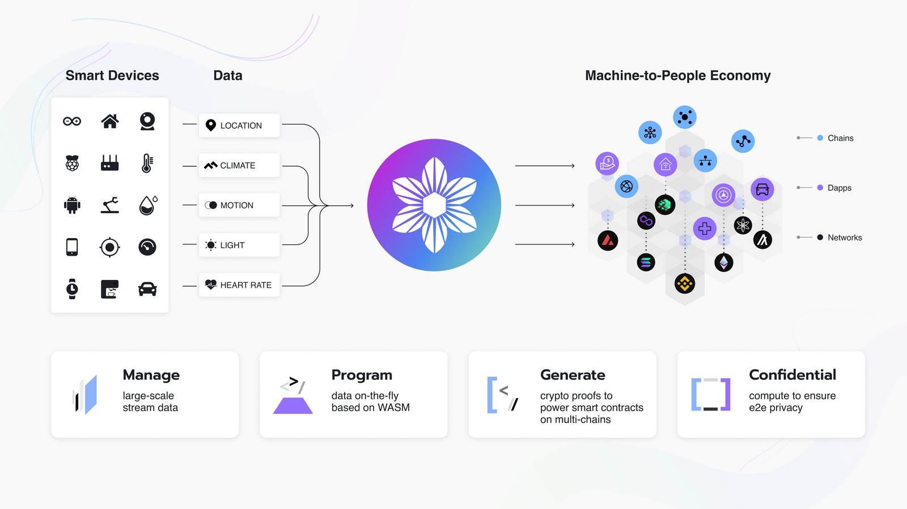

# Verifiable Compute (W3bstream)

[W3bstream](https://w3bstream.com/?ref=iotex.io) is a decentralized protocol that connects data generated in the physical world to the blockchain world.

In essence, W3bstream uses a decentralized network of nodes, which stream data from real word devices and machines. Proofs of real-world facts are generated on top of the data for utilization by dApps on various L1 and L2 blockchains.

<figure><figcaption></figcaption></figure>

Blockchain developers can leverage the W3bstream framework to access trusted real-world data for their dApps. W3bstream supports all EVM-compatible chains and will soon expand support for non-EVM chains like Solana.

### W3bstream Home



### W3bstream Docs



### W3bstream Studio


