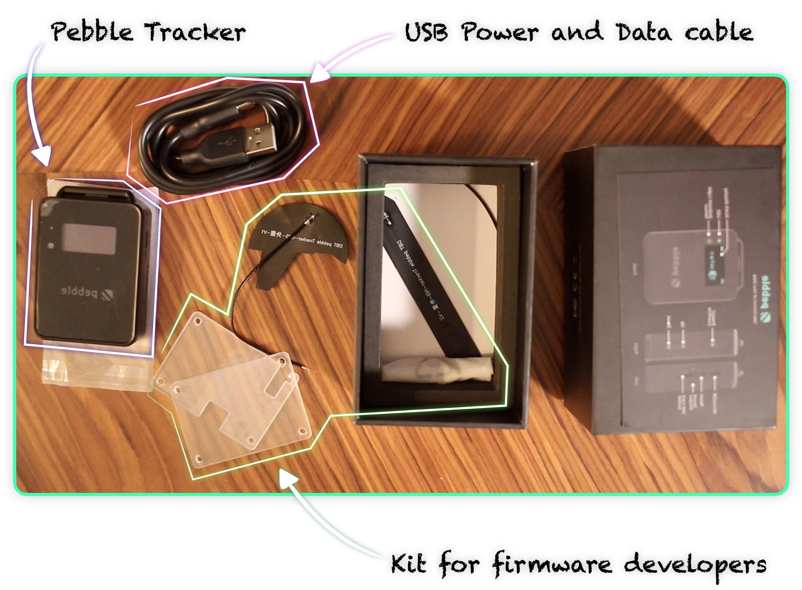
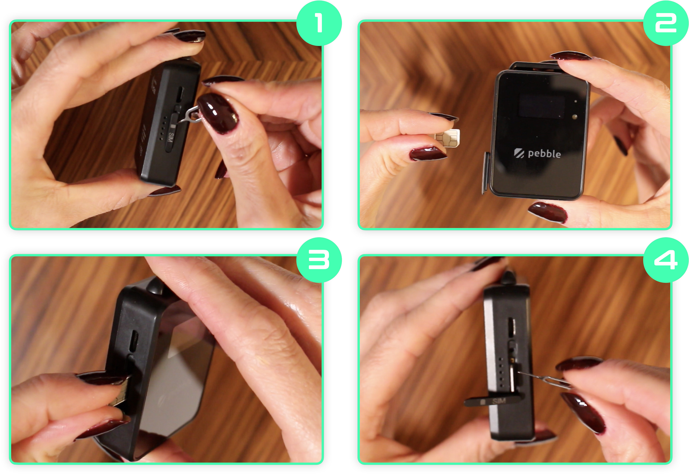
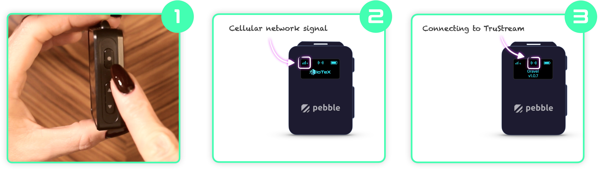

# Quick Start

Congratulations on receiving your Pebble!

This quick start guide will help you with power on your device and connecting it to the IoTeX [MachineFi portal](https://porta.machinefi.com).

### Unboxing

Before start using the Pebble, let's take a look at what's in the box:

### SIM Card

Pebble Tracker connectivity is based on the new low-bandwidth cellular protocols NB-IoT and LTE-M; therefore, **you need a valid SIM card to have it connected to the internet**. NB-IoT and LTE-M bands are optimized for Internet of Things applications like smart metering, industrial controls, residential security, etc... They consume less power, extend the device battery life, and reduce data plan costs while still improving the range.


**The SIM card is not included with Pebble Tracker; you will have to buy one.**


If you have issues finding a working SIM card that supports NB-IoT or LTE-M in your Country, you can buy one from our SIM cards portal at  \[`coming soon`].&#x20;

See the list of supported Countries below:




Please notice Pebble tracker does not support the GSM, 3G, or 4G bands:\
**make sure your SIM card provider supports NB-IoT or LTE-M or both in your country.**


Once you have a SIM card, use a paperclip or the provided SIM card tool to open the SIM slot and push the card inside:

### Power On

Press and keep pressing the power/confirm button on the right side of Pebble until you see the IoTeX logo on the screen. Wait until the cellular connection is established and Pebble Tracker starts communicating with the TruStream network:

If this is the first time you power on your Pebble Tracker, it will prompt you for adding the device to your account on the [MachineFi portal](https://portal.machinefi.com).

